# Escape & Explore

## About

Welcome to Escape & Explore, we offer amazing deals on holidays to multiple cities world-wide. For each city we display so great places to go, and give you the whole package. From accommocation, to transport, food and everything you could possibly need! Book your visit now! 

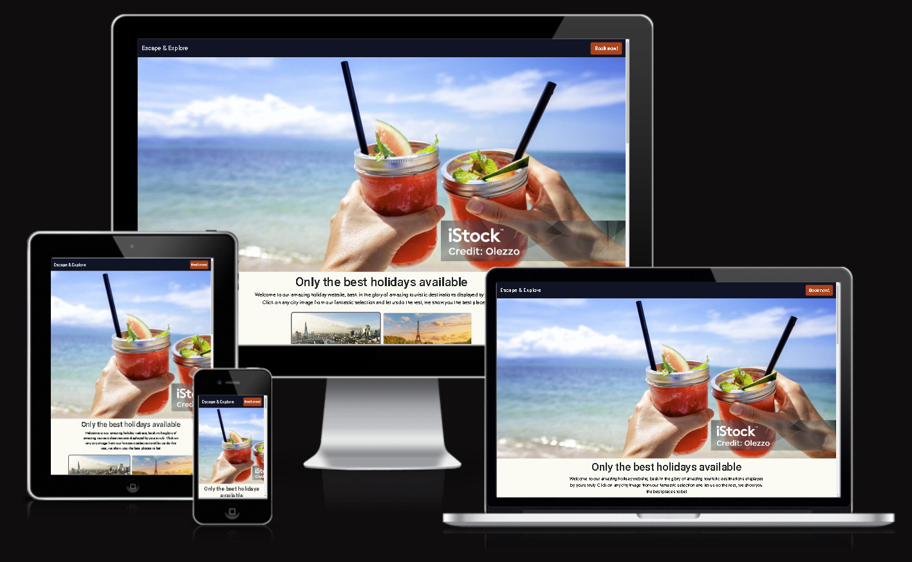

## Table of contents
- [User Experience (UX)]()

## UX

### Strategy

The website is targeting the primary stakeholders within the market which are **Young adults wanting to go on new adventures and have new experiences** and
**Adults with families**. As we are in the information age, people are able to find information about basically anything, we constantly see pictures, movies, documentaries about immaculate places and the younger generation (Young adults) specifically have the want and the means(Meaning money ofcourse) to do so. More senior adults with families have a simillar thirst for adventure and the want for new experiences too, but through research I have found that they mostly crave the occasional holiday to get a rest from work, they find a lot of respite in the fact they can leave their normal day to day lives and live the dream for a week or two.

#### Primary user stories

1. As a website user, I would like to be able to select or search for different cities so I can choose my next holiday destination

2. As a website user, I would like to be able to see my selected city on a map so I can understand the distance travelled and choose if it is right for me

3. As a website user, I would like to be able to get an insight of my potential destinations through images, descriptions and understanding where I have to travel

4. As a young adult, I would like to have a display of recommended places to visit in each destination to help me to cater each holiday to my own needs

5. As a user, I would like to be able to easily navigate to the booking area where I can create and finalise my next holiday plan

6. As a busy parent, I would like to be able to have a selection of activities for my children and I so we can spend some family time together

7. As a busy parent, strapped for cash I would like to be able to see the potential costs incurred for activities or visits

8. As a user, I would like to be able to signup for a newsletter so that I can see updated deals and new holiday destinations

9. As a user, I would like to save holiday destinations so I can come back to them at another time

10. As a user, I would like to be able to see both where I am and where my potential destination is at the same time

11. As a user, I would like to be able to see where destinations are in correlation to my current location

I made my MVP through rating each user stories on a Must have, Should have and could have basis. Stories 1-5 are **Must have**, stories 6-8 are **Should have** and stories 9-11 are **Could have**. I prioritised making all the must have's first to make sure my website is ready in time with all the important functions.

#### Primary strategic aims for the website
1. Increase foot traffic into our company's website and translate these visits into paying customers
2. Work with our partners to increase their exposure and drive sales on their website wherein we receive a commission on each sale.
3. Increase awareness of our brand through great customer experiences, social media exposure and giving a good user experience

There is an emphasis on two points for our company making this website, driving customer growth and translating this into sales, and working collaboratively with our sponsors to drive customers their way as well as their customers to us. Making sure we have a good user experience within our website will help customers enjoy their experience which will help to gain repeat customers and increase our sales in the long term. 
### Scope

Using an agile approach I made sure that we focused on making our MVP(Minimum viable product) first before focusing on any other features and thinking about additions to the website.

#### Features

* **City Selection** A display of our offers of city destinations which we have, in just the click of a button we show you exactly where this is with using our Google maps javascript API and dynamically display the best places within these cities to visit. An outline is placed on the selected city and all the needed information is output below the cards.

This feature answers the need for **user story 1**
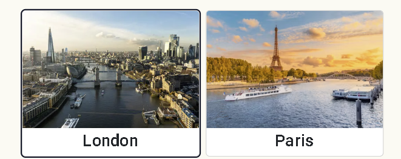

* **Google map API** To display the location of each city we use the google maps javascript API. On the click of any city the map dynamically updates to the location of the selected destination. We can't all be aware of where every destination is so we added a marker for the user's location if they give us permission. With the user marker and the city marker it helps a user understand where their destination is in relation to themselves, and helps them to make the best decision for their holiday.

This feature answers the need for **user story 2**
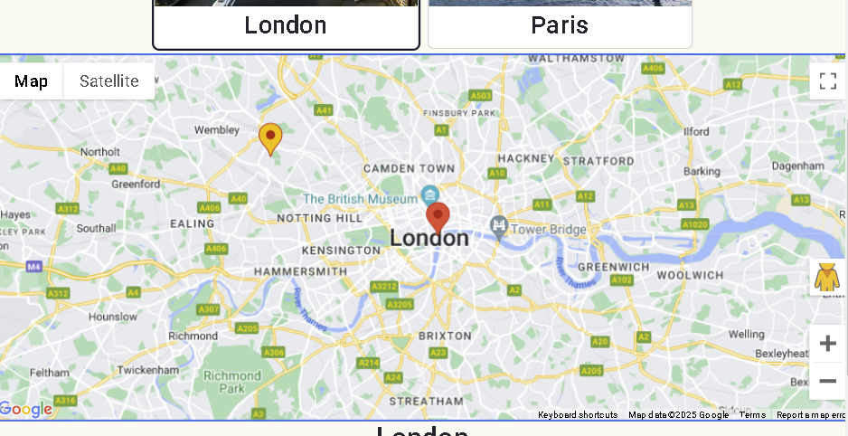

* **Home page** To assist each user in being able to pick the perfect destination for themselves and their families we make sure they get a look into every detail. We dynamically display and update images, the location and give some detailed descriptions of the locations. If a user would like to look a bit further into any given location we have direct links for each place, leading to a wikipedia page.

This feature answers the need for **user story 3**
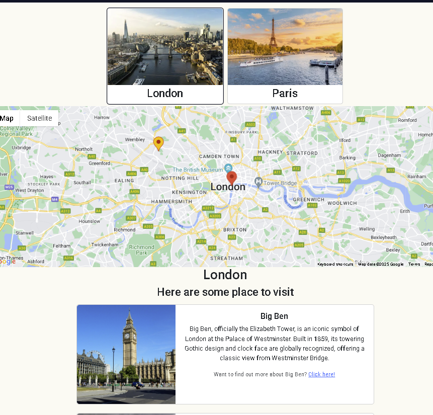

* **Places to visit** We dynamically display with every city popular destinations which each user can visit on their trip to each city. This includes images, the place title, detailed descriptions and a link for further information of each place.

This feature answers the need for **user story 4**
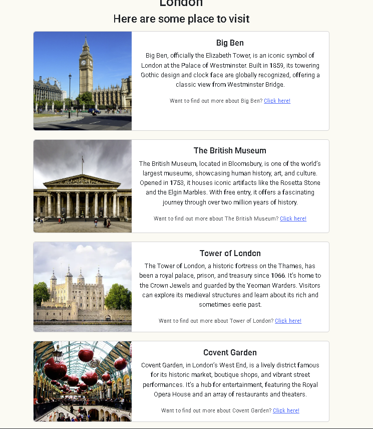

* **CTA** To make sure our users can easily navigate to the booking page our booking page buttons are always visible on the page and we can find the both on the navbar and at the bottom of the page after users are able to go through all the information on the page.
The Booking form is also very easily filled in and is followed by a success page to let a user know that they have successfully made their booking  

This answers the need for **user story 5**

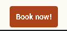

* **User locations** If user locations are permitted the user is able to see themselves on the map, this helps user decide the best holiday for themselves depending on how far they are willing to travel. If a user declines to share their location this will not affect the functionality or experience on the website. This would only remove the marker displayed and give an alert to the user regarding this. 

This would answer the need for **user story 10**

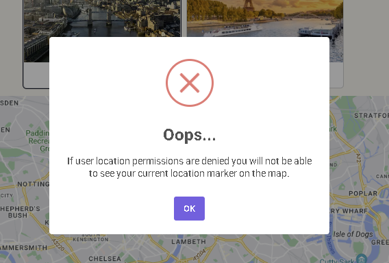

Considering all these added features we have met the targeted **MVP**, with all the added features we can confidently give our users a great experience

#### Future potential features

* **Activity display** Alongside the the places to visit feature, we can add the activities display as well. A toggle button can be added to switch back and forth between displaying places to visit and activities within the chosen city. This would answer the need for **user story 6**

* **Estimated spend** This feature would span across a few of the already added features and potential features. It would display avg spends at certain locations and activities, but also could be added in coordination with a feature of saving cities, places and activities within those cities. Each of these would be consolidated into a *saved* or *wishlist* which would be accessible to the user and display the costs and estimated totals for any given holiday combination. This would answer the need for **user story 7**

* **Newsletter** A newsletter which would be a form can be added to the bottom of the home page to be filled out by users and contacted by ourselves with potential new holidays and deals that we offer. In this way we could help to reach our own missions of keeping in touch with our customer base while helping our users keep updated with the best trips available! This would answer the need for **user story 8**

* **Save / Wishlist** A user will be able to save each city, place within that city and activity to be able to come to these later in a consolidated list. This could work together with the estimated spend feature and help to further drive website sales. This would answer the need for **user story 9**

* **Routing** A user will be able to choose a destination and see airports near themselves and be able to choose from these or if they dont enable permissions then they can manually enter the city of their choice and options will be given. Following this different routes will be displayed from one location to the other. This would answer the need for **user story 11** 

### Structure

This website has been structured with the following in mind across all pages

* This website was built with information hierarchy in mind, there is a single h1 heading per page which should give an idea of the page on its own. This is then followed by smaller headings which make sub-categories of different sections on the page and paragraphs within these, mostly used for writing descriptions.

* The home page sports potential cities for users to choose from and displays these on the map when selected and ideal visits within these cities.

* A homepage complete with a navbar which links to the home page and the booking page so you can navigate to and from these pages anywhere on the site. 

* A footer which displays our contact information for people to easily reach us and clickable social media links to bring the user to our social media accounts.

* Buttons that stand out on the page which help to achieve the main website goals which is translating a user into a customer and giving exposure to our partners.

* The look and feel of the Navigation bar, Footer and buttons across all pages are exactly the same or almost the same to give consistency to the website.

This website 
### Skeleton

Key to the website being accessible to members of the publick is it being responsive. To ensure we are able to build the website in a well structured format across different sized devices we created wireframes so we can create the general layout prior to writing any code. This would save time at a later date when actually coding. We built the website with a mobile first approach considering majority of internet traffic comes through mobile devices. Wireframes were built to answer this need and we used [Figma](https://www.figma.com/) to do this. Bearing in mind where the majority of users are in the categories of different screen sizes and the time constraints of this project we have built the website to be best on small mobile devices(320px+), medium tablet devices(576+) and the average sized monitor user(992px - 1200px). The website still displays well on very large screens of 1200px+ but is capped at the extremely large screens(The body has been limited to 1800px which still accommodates large screens well).

Links for these are below

[Home page](https://www.figma.com/design/qrtbFGiOTw3PbmsQwOob1q/Milestone-project-2?node-id=0-1)
[Booking page](https://www.figma.com/design/qrtbFGiOTw3PbmsQwOob1q/Milestone-project-2?node-id=26-52)
[Success and Error pages](https://www.figma.com/design/qrtbFGiOTw3PbmsQwOob1q/Milestone-project-2?node-id=100-2)

### Surface

Considering the importance of accessibility in todays world I built the website with good contrast ratio in mind across all elements.

#### Colour

I decided to use black, white, a baby powder background and red to draw attention to buttons. Researching I found that light, bright and fun color like yellow and white are quite consistently found across the large majority of holiday websites. This is the keep the focus on the content of the website and to give the user a fun feel for the holiday which is exactly what the majority of our demographic target customers base want!

[Coolors](https://coolors.co/) was used to create my color palette.

#### Images

For all the images used in the website we used [Unsplash](https://unsplash.com/)
and [Pixabay](https://pixabay.com/). These websites offered a greate amount of non-copyrighted images which are available to be used by the public. Each image was chosen for the bright colors and amazing looking architecture which is 2 very large components of what attracts people to different destinations.

Where necessary images have been passed through [TinyJPG](https://tinyjpg.com/) to imrpove webpage performance in load times.

## Features

### Global features

* Nav
 The navigation sporting the company logo which can be clicked to lead the user back home and the CTA (call to action) button for our booking page. The navbar is found across all pages at all times as it is fixed to the top of the page to make sure users can easily and intuitively navigate across the site.

 

* Buttons
All buttons across the site have the same design to ensure consistency across the site, on the home page the buttons are used to encourage and bring attention towards themselves and get customers to the booking page

* Bootstrap cards 
BS cards were used to streamline and ease the process of repetitively displaying information for our users 
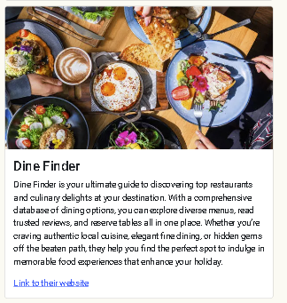
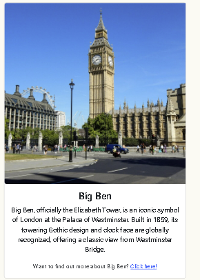

* Footer
Our footer is used to display our contact information, should any customer want to get in contact with us by any means. Social media links are displayed and on click lead the user to our pages.

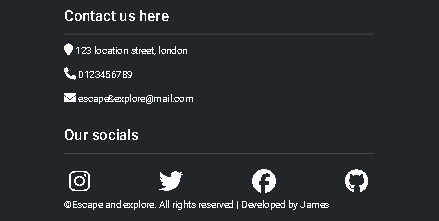

* Meta data

To assist in the mission of driving foot traffic into the website we had SEO(Search engine optimization) in mind. We added meta data to every page of the site providing good data for search engines to display our website.

* Redirection

Incase of any problems with incorrectly input links or broken links we have a 404 page to give users the error feedback and help them navigate back to the home page

### Javascript specific features
This website was built with significant javascript functionality in mind

#### City selection
When any city is selected this dynamically changes the map and the places to visit sections on the home page. This also dynamically sets custom CSS styles to the selected city.

#### Maps API
The map is updated to any city which is selected, this is powered by Google's API technology.

#### Places to visit
On select of a city the places to visit is displayed, an image, title description and a link is all dynamically updated. If a package is not selected this is by default set to silver.

#### Package deals select & City select
In the booking page the selection of different package deals and a city is both done through javascript. This dynamically updates the value of a hidden input in the form so that it can propagate the passed data to the back-end. If a city is not selected however Javascript form validation kicks in and displays an error, this will also prevent form submission.
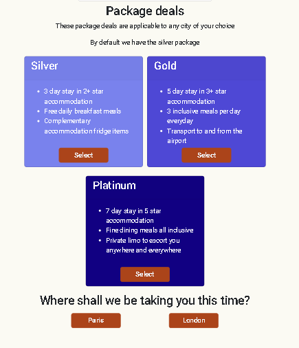

#### JS validation
In addition to HTML validation in our form we also have Javascript doing validation for the cities to make sure an option is selected and to make sure emails given are matching.

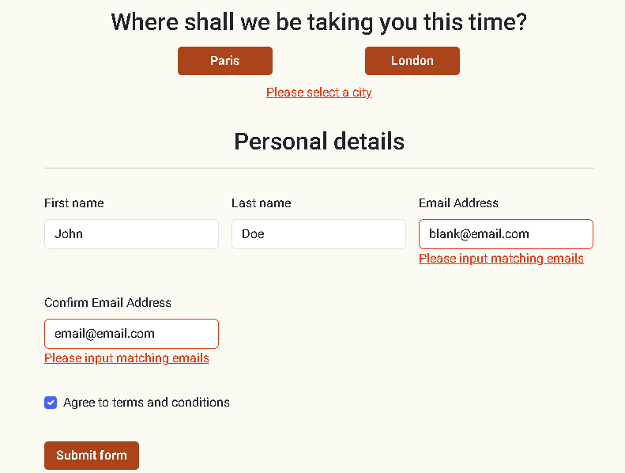

## Technologies

### Programming Languages
* [HTML5](https://en.wikipedia.org/wiki/HTML5)
* [CSS3](https://en.wikipedia.org/wiki/CSS)
* [Javascript](https://en.wikipedia.org/wiki/JavaScript)

### Applications used

1. [Visual studio code](https://code.visualstudio.com/) - My personal IDE of choice
2. [Figma](https://figma.com/) - Used for my wireframes 
3. [Github](https://github.com/) - Site deployment and allows others to see my site
4. [Am I responsive](https://ui.dev/amiresponsive) - Shows my site on multiple screen sizes
5. [Google fonts](https://fonts.google.com/)- To import my fonts
6. [Tiny Img](https://tinyjpg.com/) - To optimize my images
7. [Google sheets](https://en.wikipedia.org/wiki/Google_Sheets) - To create my gantt chart and display how to project was developed
8. [W3Schools](https://www.w3schools.com/) - For syntax information
9. [MDN](https://developer.mozilla.org/en-US/) - For syntax information
10. [Pixabay](https://pixabay.com/) - For images
11. [Unsplah](https://unsplash.com/) - For images

## Testing

Throughout the build phase I used the console in chrome developer tools to ensure there are not any arrors popping up from features being developed. I also used this for debugging incase of any problems, this was very useful specifically for the javascript aspect of this project.

Manual testing is the chosen method of testing in this project, we do this to identify any defects within our code and website, when these are identified they must be fixed before release. This is accomplished by a user or a person simulating a user manually going through components of the site ensuiring everything functions as it should. Early testing is critical and testing while coding, making sure errors are not present during development will save significant time and undue stress later in the project. Projects should be deployed early or mid project and not at the end, often during deployment bugs are found and should never be left to the end. We also have to keep in mind that you cannot check for every single bug, sometimes bugs will be found after release of the project.

Automated testing like using JEST has not been implemented in this project. The principles of automated testing are very simillar to manual testing in the points of early testing, early deployment, defect-detection focus, the absence of errors fallacy and that not every bug can be checked for. I have however run my code through validators to check my HTML, CSS and website accessibility.

* Features answering User goals
Within the UX > Scope section, each feature has comments answering how each goal is answered by these

Navbar

| Feature | Expected Outcome | Testing Performed | Result | Pass/Fail |
|---------|-------------------|-------------------|--------|-----------|
|Navbar is fully responsive|Navbar adjusts well for different device sizes|Adjust screen size|||
|Company logo|On click this leads you to the home page|Logo is clicked|||
|CTA button|On click this leads you to the booking page|Booking button clicked|||

Home page

| Feature | Expected Outcome | Testing Performed | Result | Pass/Fail |
|---------|-------------------|-------------------|--------|-----------|
|Hero image|On screen resize the image still displays well|Screen resize|||
|Map|On allow of location permission the map displays the users location with a gold marker|Location permissions are allowed|||
|Alert|On decline of location permission a modal is displayed displaying a message|Location permissions denied|||

City selection(Home page)

| Feature | Expected Outcome | Testing Performed | Result | Pass/Fail |
|---------|-------------------|-------------------|--------|-----------|
|Map|On selection of a city the map is moved to be centred to that city and previous city marker is removed|City selected|||
|Map|On page load the map is loaded and displayed|Page reload|||
|Map|On page load the map is set to a default city which is London|Page reload|||
|City cards|On screen resize the city cards display well |Screen resize|||
|City cards|On hover of each city card a shadow appears surrounding the card|Mouse hover over city card|||
|City cards|On page load the London city card is set as the default city displayed and is outlined|Page reload|||
|City cards|The selected city title is responsively displayed under the map||||
|City selecardsction|On selection of a different city a previously selected city outline must be removed|Different city is selected|||
|City cards|On Selection of a city the city is outlined|City is selected|||
|Places to visit|On selection of a city, places within the chosen city are displayed|City is selected|||
|Places to visit|When cards are rendered the image displays correctly|Select different cities and check image rendering|||
|Places to visit|On selection of a city, each cards title is displayed correcty and is accurate|Check each displayed place title|||
|Places to visit|On selection of a city, each cards description is displayed correctly and is accurate|Check each displayed description|||
|Places to visit|On selection of a city, each card displays a link so that the user can find out more information about each place|Check each card is displaying a link|||
|Places to visit|On click of a places anchor link, a new tab is opened which will give the user more information about the chosen place|Click all links|||
|Places to visit|Each card is displayed responsively so that users on different devices can see this properly|Screen resize|||
|CTA at the bottom of the home page|CTA is additionally displayed at the bottom of the page under the displayed places to visit|Scroll to bottom of the home page|||
|CTA at the bottom of the home page|On click the user is brought to our booking page|Button clicked|||

Partner sponsorships(Booking page)

| Feature | Expected Outcome | Testing Performed | Result | Pass/Fail |
|---------|-------------------|-------------------|--------|-----------|
|Cards responsiveness|On screen resize the cards are displayed well|Screen resize|||
|Cards image|Each cards image displays well, and on most screen sizes|Screen resize|||
|Cards links|Links of each cards opens a new tab leading to the correct partner websites|Links clicked|||

Package deals

| Feature | Expected Outcome | Testing Performed | Result | Pass/Fail |
|---------|-------------------|-------------------|--------|-----------|
|Select buttons |On hover the buttons change color|Button hover|||
|Select buttons|If not selected a clicked button will change color|Button clicked|||
|Select buttons|On select of any button the hidden input found in the booking form reflects the selected package deal||||
|Select buttons|On deselect of a button the color reverts back to the original color|Deselect button|||
|Select buttons|On deselect of a button the value of the hidden input reverts back to the default value of silver|Deselect button|||
|Select buttons|If a package was selected and another is clicked, the initially selected button reverts back to the original color|Select one package, then select another|||
|Package deal input|By default the hidden input in the booking form for package deals value is set to silver|Reload page and check hidden input value|||

City selection

| Feature | Expected Outcome | Testing Performed | Result | Pass/Fail |
|---------|-------------------|-------------------|--------|-----------|
|Select buttons|On select of a city, the button changes color|Button clicked|||
|Select buttons|On select of a city, the hidden city input found in the booking form |Click a city|||
|Select buttons|On deselect of a city the color of the city reverts back to the original|Deselect button|||
|Select buttons|On deselect of a city the hidden input value of this city in the booking form is removed|Deselect city|||
|Select buttons|If a city is selected and another city button is clicked, the previously selected city color reverts back to the original|Select a city then select a different one|||
|Select buttons|If a city is selected and another city button is clicked, the hidden input value in the booking form changes to this new value|Select a city then select another|||

Booking form

| Feature | Expected Outcome | Testing Performed | Result | Pass/Fail |
|---------|-------------------|-------------------|--------|-----------|
|HTML validation|If any of the visible form inputs are incorrectly filled and the form is submitted HTML validation displays errors|Incorrectly fill out the form or leave blank and submit|||
|JS validation|If the emails input do not match, custom JS validation kicks in and displays a red error||||
|JS validation|If the emails input do not match, the form inputs turn red|Input different emails and submit|||
|JS validation|If the emails input did not match and then the emails are corrected to match, the error messages displayed are removed|Input different emails, submit the form, then make the emails match|||
|JS validation|If the emails input did not match and then the emails are corrected to match, the red borders around the email inputs revert back to normal|Input different emails, submit the form, then make the emails match|||
|Form submit|If the form is correctly filled out and submitted, the success page opens and the user is given a message informing them they have successfully booked their holiday|Form filled out and submitted|||
|Form responsiveness|Form is responsive across multiple screen sizes|Screen resize|||

Footer

| Feature | Expected Outcome | Testing Performed | Result | Pass/Fail |
|---------|-------------------|-------------------|--------|-----------|
|Footer contacts|Contacts displays responsively so that it is properly visible for different devices|Screen resize|||
|Footer socials|Contacts displays responsively so that it is properly visible for different devices|Screen resize|||
|Footer socials|On hover of each icon it changes color|Hover over icon|||
|Footer socials|On click of each icon it opens a new tab which is the corresponds to the icon clicked||||

Success page

| Feature | Expected Outcome | Testing Performed | Result | Pass/Fail |
|---------|-------------------|-------------------|--------|-----------|
|Success page responsiveness|The success page displays well across different screen sizes|Screen resize|||
|Success page|The page is displayed on correctly filling out the booking form and submitting|Correctly fill out the form and submit|||
|Home button|The user is able to easily locate the home button, which redirects the user back to the home page without using the browser back buttons|Click the home button|||

404 page

| Feature | Expected Outcome | Testing Performed | Result | Pass/Fail |
|---------|-------------------|-------------------|--------|-----------|
|404 page|On type of an non-existent/incorrect link, click of an incorrect link, the user is led to the 404 page|Type in an incorrect link|||
|Home button|Without using the browser back buttons, the user is able to navigate back to the home page of the website using the home button displayed|Click home button|||

### HTML Validator

### CSS Validator

### Lighthouse

### Notes of errors, bugs, issues and incomplete items

* During development of the booking page I noticed an error in the console showing

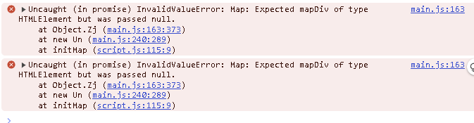

It appeared as though the issue was revolving around the google maps api trying to initialise the map when the map didnt exist on the new page
so to resolve the issue I added an if check on the initMap function contents to prevent these running if there is no map in the current page.
I then proceeded to check that this did not impact the map on the home page and indeed, success!

* As I was implementing the google maps API, the map was refusing to show regardless of any changes I made to the API code. I soon realised I had the incorrect attribute on the script tags in the html file. All was working after changing 

This was the incorrect script attribute

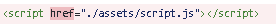

This is the corrected one

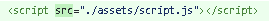

* In the handleCityClick function which changes the chosen city, I was unable to target the clicked city. I had to use dot notation in this instance to get the code working, I would normally stick to only one in my script but in this instance I had to mix it up a bit.

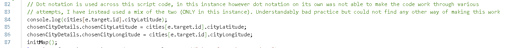

* When I made my navbar fixed the bootstrap cards were showing on top of it

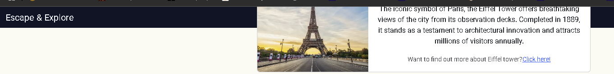

To resolve this issue I used z index on the navbar to keep it on top of every other element in the webpage

* I changed the selectable item in the city cards on the home page to be the whole card as ooposed to the image, but this caused some
issues with the javascript code working with the bootstrap cards. The image and title's were able to be selected but the targeting needed to be on the parent instead so that the user could click anywhere on the card.

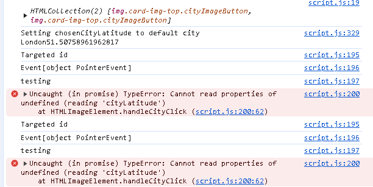

To resolve the issue I used the same code but just added the *closest* syntax to the targeting so that I could target the parent regardless of where I clicked in the city cards 

## Deployment & Development

### Deployment

<!-- This deployment guide is copy pasted from my own code in the repository Jamie's Gym -->
This website is deployed on github pages - [Escape & Explore](https://github.com/JamesBracken/Escape-and-explore?tab=readme-ov-file)

**Deploying**

How to deploy a site using GitHub Pages:

1.Create a github account
2.Sign in to github
3.Click on settings
4.Go to the project repository - [Escape and explore](https://github.com/JamesBracken/Escape-and-explore?tab=readme-ov-file)
5.Choose *Pages* in the navigation menu on the left side of the screen
6.In the source dropdown, Make sure you are on *main* branch and then click on save

After you have completed all these the website will start to be constructed by github pages, following this you will be able to open your page from the home page of your repository on the right side within the *Deployments* section

### Local Development

**Cloning**
To clone a repository follow these steps

1.Login in to Github or create an account if you haven't already

2.Go to this project repository [Escape & Explore](https://github.com/JamesBracken/Escape-and-explore?tab=readme-ov-file)

3.Click on the *Code* button and select whether you would like to cline with HTTPS, SSH or the Github CLI and then copy the link shown

4.Open your terminal in your IDE/code editor of choice then change the current working directory to the location you would like to use for the cloned directory

5.type "git clone" into the terminal and paste the link you copied in the third step the press Enter

**Commiting and Pushing Changes**

1.Open the termin in the directory of your cloned repository

2.Using "git status" check to see your changes are correct

3.If you are ready to commit  type "git add ." to stage all saved changes to be commited, you can alternatively use "git add YOUR_FILENAME" to stage specific files for commit

4.Using "git commit -m "Write your commit message here" commit your changes with a descriptive message, give a good amount of detail but try not to go over 50 characters

5.Finally use "git push origin main" to push your changes to the main branch of your github repository

**Forking**

To fork this repository follow these steps

1.Setup Git and make sure your git has github authentication
2.Go to the web page repository [Escape and explore](https://github.com/JamesBracken/Escape-and-explore?tab=readme-ov-file) 
3.Click on *fork* on the upper right portion of the page.
4.This has now forked the repository to your own profile. 
5.Go to your profile and navigate to the forked repository.
6.Click on *Code* above the list of forked files
7.Choose the option you need from the dropdown menu. 

Further assistance can be found [HERE](https://docs.github.com/en/pull-requests/collaborating-with-pull-requests/working-with-forks/fork-a-repo) on the github Fork a Repo page

### Environmental variables / scripts
This webpage does not require any additional environmental variables or scripts, all scripts used in this project are imported within the code itself. 

## Credits

### Code Used

* For the initMap function I copy pasted this from the [google maps javascript API](https://developers.google.com/maps/documentation/javascript?_gl=1*1jc5oj6*_up*MQ..*_ga*MTQyODU0OTAzMi4xNzM1NTcwNjY5*_ga_NRWSTWS78N*MTczNTU3MDY2OC4xLjAuMTczNTU3MDY2OC4wLjAuMA..) documentation and then tweaked the code to make it dynamically update
to the users actions, code is below 

async function initMap() {
  //@ts-ignore
  const { Map } = await google.maps.importLibrary("maps");
  const { AdvancedMarkerElement } = await google.maps.importLibrary("marker");

  map = new Map(document.getElementById("map"), {
    zoom: 4,
    center: {lat: chosenCityDetails.chosenCityLatitude , lng: chosenCityDetails.chosenCityLongitude },
    mapId: "DEMO_MAP_ID",
  });

  const marker = new AdvancedMarkerElement({
    map: map,
    position: {lat: chosenCityDetails.chosenCityLatitude , lng: chosenCityDetails.chosenCityLongitude },
    title: "Uluru",
  });
}

- [Bootstrap form in booking page](https://getbootstrap.com/docs/5.3/forms/validation/)

- [Bootstrap cards](https://getbootstrap.com/docs/4.0/components/card/)

### Acknowledgements / Tutorials

#### Tutorials
- [CI README.md guide](https://www.youtube.com/watch?v=l1DE7L-4eKQ)

